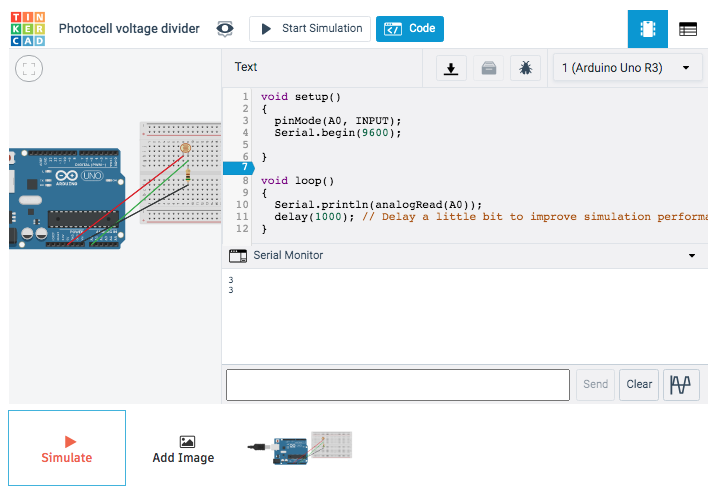
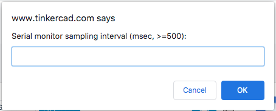
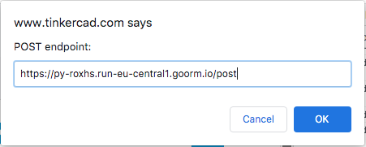
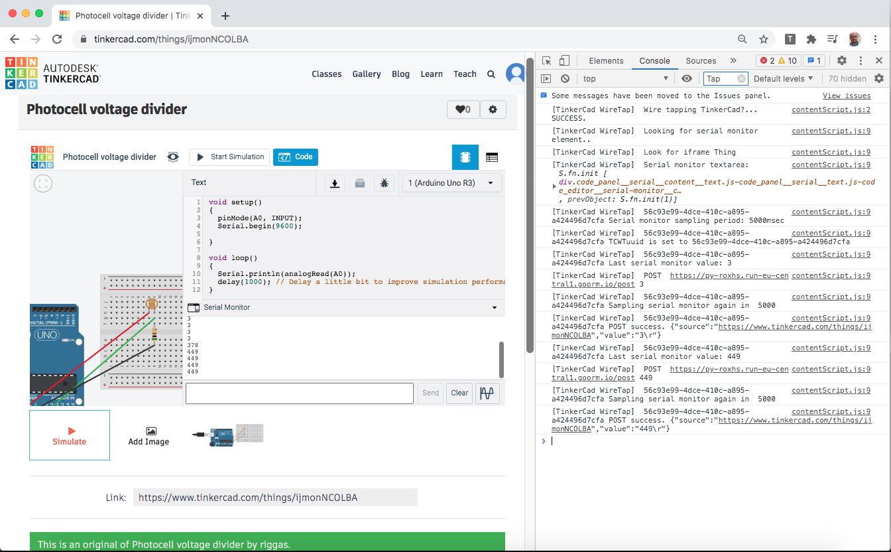
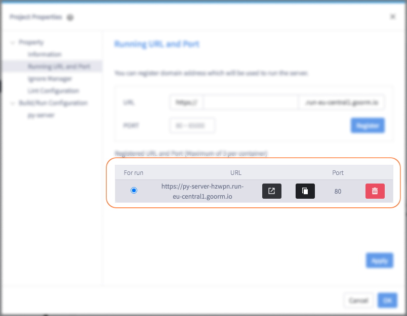
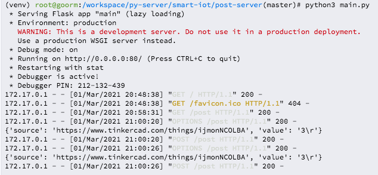

# DDI196 Έξυπνες Τεχνολογίες και εφαρμογές

Σε αυτό το repository μπορείτε να βρείτε χρήσιμο υλικό για το μάθημα DDI196 Έξυπνες Τεχνολογίες και εφαρμογές.

---

### Δημιουργία ενός έξυπνου IoT-Cloud συστήματος

Για την υποστήριξή σας στην ανάπτυξη ενός πρότυπου συστήματος που συνδυάζει ένα (simulated) Arduino και όποια cloud based πλατφόρμα επιθυμείτε.

#### _i. Αξιοποίηση TinkerCad_
Δημιουργήστε στο [TinkerCad](https://www.tinkercad.com/) ένα (δωρεάν) λογαριασμό και δημιουργήστε μια _σύνθεση_ βασισμένη σε Arduino και αισθητήρες της επιλογής σας.  
Για την αξιοποίηση του Arduino σε συνδυασμό με άλλες web/cloud υπηρεσίες χρησιμοποιήστε το Google Chrome plugin που βρίσκεται στο φάκελο `Gext-tinkercad`.  

##### _i-a Google Chrome extension for TinkerCad_

**Η χρήση Google Chrome είναι απαραίτητη, <ins>ίσως</ins> δουλεύει και σε Linux Chromium - δώστε feedback στα issues**

* Αφού κάνετε clone το τρέχον repo στο pc σας ακολουθήστε τις οδηγίες για Chrome Extension development [εδώ](https://developer.chrome.com/docs/extensions/mv2/getstarted/) ώστε να ενεργοποιήσετε αυτό το extension στο σύστημά σας, ή απλά ακολουθήστε τη σύνοψη:

    * Open the Extension Management page by navigating to `chrome://extensions`.
    * Enable Developer Mode by clicking the toggle switch next to **Developer mode**.
    * Click the **LOAD UNPACKED** button and select the extension directory.  
    


* Το extension είναι πλέον διαθέσιμο στο σύστημα σας και μπορείτε να το ενεργοποιήσετε από το εικονίδιο των extensions δίπλα στο address bar.
    * _Κάντε το pin ώστε να το βρίσκετε γρήγορα. :-)_
    * Δεν παρέχει κάποιο UI, μπορείτε να παρακολουθήσετε τη λειτουργία του extension από το `View > Developer > Developer Tools > Console`. Το extension κάνει log με πρόθεμα **[TinkerCad WireTap]**.


* Το extension έχει πρόσβαση (permission) σε όλα τα url τύπου **https://www.tinkercad.com/things/**xxxxxxxxx, πχ https://www.tinkercad.com/things/ijmonNCOLBA, είτε είναι δικό σας είτε άλλου χρήστη!

    * Η βασική του λειτουργία είναι ότι _παρακολουθεί_ ό,τι γράφει το Arduino στο serial monitor κατά τη διάρκεια του simulation.  
    

    * Έχει τη δυνατότητα κάθε x msec να διαβάζει την τελευταία γραμμή του serial monitor και αυτή την τιμή (που μπορεί να είναι μια αριθμητική τιμή από ένα αισθητήρα ή ένα string που περιλαμβάνει τιμές πολλών αισθητήρων):
        * να την εμφανίζει στο Console του Chrome
        * να την κάνει HTTP POST σε ένα endpoint που δηλώνει ο χρήστης

##### _i-b Χρήση Google Chrome extension for TinkerCad_

* Δημιουργείτε το κύκλωμα σας στο TinkerCad και γράφετε τον κώδικα που το ελέγχει
    * Φροντίστε ό,τι τιμές θέλετε να μεταβιβάζονται από το TinkerCad στην cloud υπηρεσία που θα επιλέξετε να γίνονται από το Arduino print στο serial monitor.  

* Ξεκινάτε το simulation.

* **Click** στο εικονίδιο του extension. Με το click θα σας ζητηθούν μέσω javascript prompt:

    * Η **περίοδος δειγματοληψίας**, πόσο συχνά δηλαδή το extension θα διαβάζει το serial monitor.  
    

    * Το **https endpoint**  στο οποίο θα στέλνονται τα δεδομένα. (Μπορεί να είναι κενό - οπότε στο Console θα εμφανίζεται ένα http post error, αλλά κατά τα άλλα το extension θα δουλεύει)  
    

* Επιθυμητό είναι να δείτε στο Chrome Console (κάντε filter πχ με τον όρο _Tap_ για να βλέπετε μόνο το output του extension):  
  

<small>_Disclaimer:_ το extension παρέχεται για να σας βοηθήσει να συνδυάσετε το simulated Arduino με άλλα cloud services. Για οποιαδήποτε δυσλειτουργία, bug (_it's not a bug, it's a feature_), επιθυμητή αλλαγή.. μη ρωτήσετε, _hack your way to it!_  
Pull requests are welcome :-)</small>

#### _ii. Υλοποίηση ενός http post endpoint_

Μπορείτε να αξιοποιήσετε ο,τι endpoint μπορεί να κάνει consume ένα json το οποίο έχει τη μορφή:  
`{'source': 'https://www.tinkercad.com/things/ijmonNCOLBA', 'value': '449\r'}`  
Το `source` δηλώνει από ποιο tinkercad thing προέρχονται τα δεδομένα, το `value` είναι η τιμή που έχει διαβαστεί από το serial monitor.

Για να ξεκινήσετε, και καθώς το api που θέλετε να αξιοποιήσετε ίσως θέλει κάποιο άλλο format δεδομένων, σας παρέχεται ένα sample http post endpoint γραμμένο σε python το οποίο μπορείτε να αξιοποιήσετε/τροποποιήσετε όπως θέλετε.

##### _ii-a Αποκτήστε πρόσβαση στο cloud ide GoormIDE_

* Κάνετε (δωρεάν) εγγραφή στο https://ide-run.goorm.io/
* Δημιουργήστε ένα container (σας παρέχει έως πέντε) βασισμένο σε **python**. Ας είναι private, δεν έχει σημασία πού φιλοξενείται, αφήστε όλα τα άλλα default.
* Ξεκινήστε την εκτέλεση του container και εντός αυτού σε ένα terminal εκτελέστε:  
    ```
    git clone https://github.com/riggas-ionio/smart-iot.git
    cd smart-iot/post-server/
    python3 -m venv venv
    source venv/bin/activate
    pip install -r requirements.txt
    python3 main.py
    ```

    * Όταν θέλετε να ξαναξεκινήσετε το endpoint αρκούν τα:
    ```
    cd smart-iot/post-server/
    source venv/bin/activate
    python3 main.py
    ```
    Αν προσθέσετε άλλα dependencies στο requirements.txt, τρέξτε και το `pip install -r requirements.txt`.


* Η τελευταία εντολή ξεκινά το main.py (***μελετήστε το, στο φάκελο post-server***) το οποίο εκτελεί ένα python flask server, θα δείτε ένα output σαν:  

    ```
    * Serving Flask app "main" (lazy loading)
    * Environment: production
      WARNING: This is a development server. Do not use it in a production deployment.
      Use a production WSGI server instead.
    * Debug mode: on
    * Running on http://0.0.0.0:80/ (Press CTRL+C to quit)
    * Restarting with stat
    * Debugger is active!
    * Debugger PIN: xxx-xxx-xxx
    ```

* Για να δείτε σε ποιο public url είναι διαθέσιμο το endpoint αυτό, μεταβείτε στο menu του GoormIDE `PROJECT > Running URL and Port`.  
  
    * Το endpoint σας είναι διαθέσιμο στο (url που βλέπετε)+`/post`, πχ https://py-server-hzwpn.run-eu-central1.goorm.io/post


* Αν όλα έχουν παει καλά, εκτελώντας το TinkerCad simulation (και αφού δώστε σωστό sampling period & http endpoint στο Chrome extension) θα πρέπει να βλέπετε τα δεδομένα να φτάνουν στο terminal του GoormIDE:  
  

<small>_Disclaimer:_ το http post endpoint παρέχεται για να σας βοηθήσει να έχετε ένα minimal endpoint να _υποδεχθει_ τα δεδομένα που στέλνετε από το Arduino. Επεκτείνετε τον κώδικα προσθέτοντας κάποια _λογική_, συνδυάστε το με άλλα cloud based apis, κλπ. Για οποιαδήποτε δυσλειτουργία, bug (_it's not a bug, it's a feature_), επιθυμητή αλλαγή.. μη ρωτήσετε, _hack your way to it!_  
Pull requests are welcome :-) </small>

_We wish you happy coding ! ☕_
