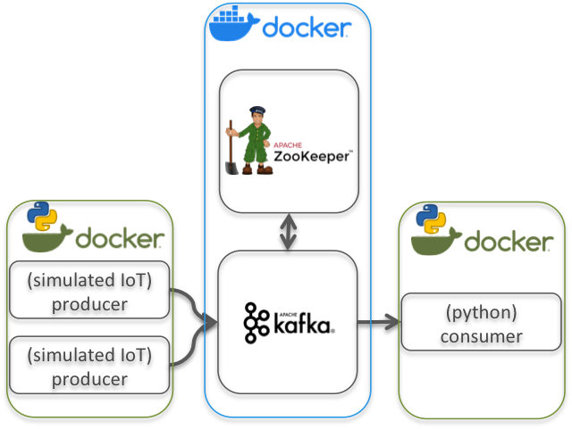

# IoT - Kafka demo

## Demo 1: Docker-based kafka broker, host-based consumer producer



* Start Kakfa broker (and ZooKeeper): `docker-compose -f demo-1/docker-compose.yml up`  
Docker compose YML file:
```
    version: '3.5'

    networks:
      confluent:
        name: confluent

    services:
      zookeeper:
        image: confluentinc/cp-zookeeper:latest
        container_name: zookeeper
        networks:
          - confluent
        environment:
          ZOOKEEPER_CLIENT_PORT: 2181

      kafka3:
        image: confluentinc/cp-kafka:latest
        container_name: kafka3
        networks:
          - confluent
        depends_on:
          - zookeeper
        ports:
          - "19092:19092"
          - "29092:29092"
        environment:
          KAFKA_BROKER_ID: 1
          KAFKA_ZOOKEEPER_CONNECT: zookeeper:2181
          KAFKA_OFFSETS_TOPIC_REPLICATION_FACTOR: 1
          KAFKA_ADVERTISED_LISTENERS: PLAINTEXT://kafka3:9092,CONNECTIONS_FROM_HOST://localhost:19092,CONNECTIONS_FROM_LAN://192.168.1.6:29092
          KAFKA_LISTENER_SECURITY_PROTOCOL_MAP: PLAINTEXT:PLAINTEXT,CONNECTIONS_FROM_HOST:PLAINTEXT,CONNECTIONS_FROM_LAN:PLAINTEXT
```

    ***N.B. Different ports for inside docker and outside docker access***

* Setup the python environment for the clients, we'll use a Dockerfile to make sure we all have the same specs: `docker build -t my_python_env -f ./demo-1/Dockerfile ./demo-1/`. The provided Dockerfile builds an ubuntu image with required python3 and confluent's python kafka library.  
    ```
    FROM ubuntu:20.04

    RUN apt-get update && apt-get install -y locales && rm -rf /var/lib/apt/lists/* \
        && localedef -i en_US -c -f UTF-8 -A /usr/share/locale/locale.alias en_US.UTF-8
    ENV LANG en_US.utf8

    RUN apt-get update && apt-get install -y build-essential
    RUN apt-get install -y python3
    RUN apt-get install -y python3-pip
    RUN pip3 install confluent-kafka

    WORKDIR /code
    ```
    * Then run a producers client container: `docker run -ti --name iot_prod -v $(PWD):/code my_python_env`
        * Within that container run a simulated IoT sensor that published to the kafka broker:  
        `root@fcbb162c8bca:/code# python3 /code/demo-1/iot_producer.py 192.168.1.6:29092 demo1test1 SenseTemp_01 -2 22`  
        This code uses confluent's python kafka library and connects to kafka broker `192.168.1.6:29092` _(notice, we connect to the port that is available for outside docker connections, we opt not to join the confluent network, thus we simulate the fact that clients can be on different physical/virtual networks)_ and simulates a temperature sensor named `SenseTemp_01` that sends a reading (every 3 to 10 sec, random delay) of a value between -2 and 22 to topic `demo1test1`.
        * Run the same command with altered sensor names and value ranges in order to simulate multiple sensors.

    * Run a consumer client container: `docker run -ti --name iot_cons -v $(PWD):/code my_python_env`
        * Within that container run a consumer code that reads messages published to the kafka broker:  
        `root@15cab5f7aaf0:/code# python3 /code/demo-1/iot_consumer.py 192.168.1.6:29092 demo1test1`  
        This code uses confluent's python kafka library and connects to kafka broker `192.168.1.6:29092` _(notice, we connect to the port that is available for outside docker connections, we opt not to join the confluent network, thus we simulate the fact that clients can be on different physical/virtual networks)_ and simulates kafka consumer that reads all messages that are sent to topic `demo1test1`.
        * As with producers, you can also run multiple consumers; each consumer has set `'auto.offset.reset': 'earliest'` thus reads _all_ messages stored on kafka broker (limited only by the topics retention period).

    * Make sure you use an IP address where the docker compose multi-container app host listens to, instead of `192.168.1.6` in the examples above.

---
Resources:
* https://cwiki.apache.org/confluence/display/KAFKA/Clients
* https://github.com/confluentinc/confluent-kafka-python
* https://kafka.apache.org/documentation/#api
* https://www.confluent.io/blog/kafka-client-cannot-connect-to-broker-on-aws-on-docker-etc/
